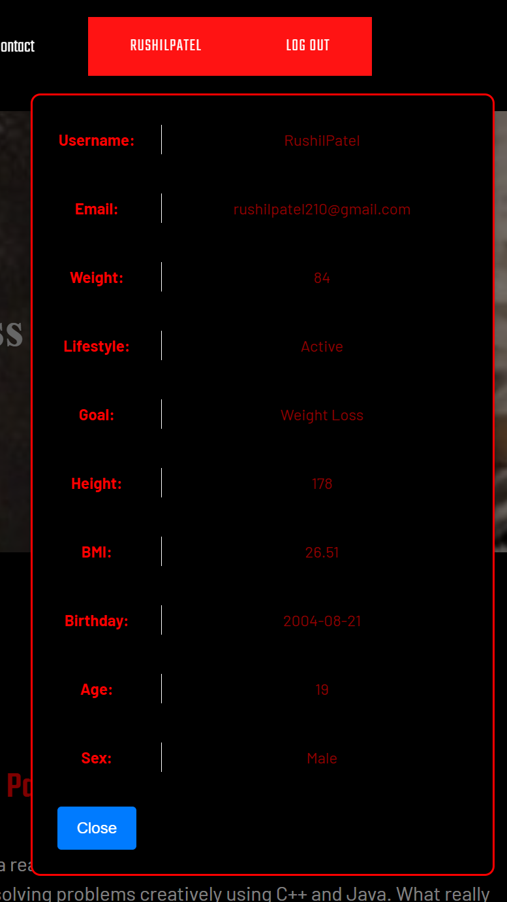
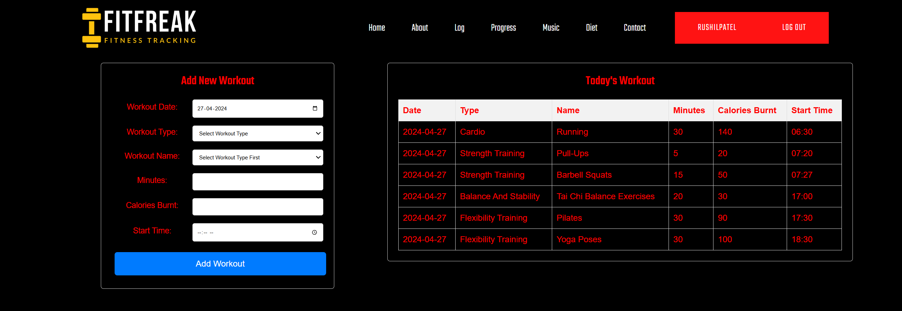
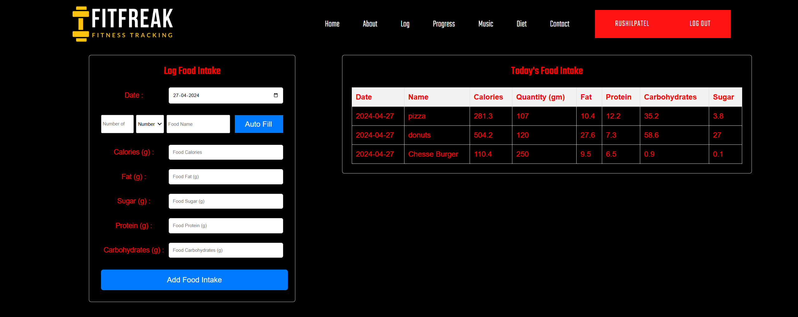
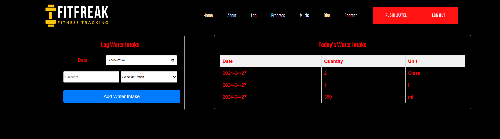
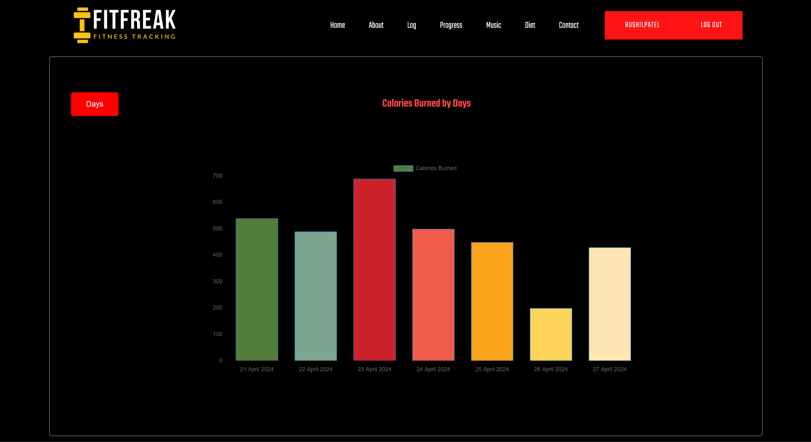
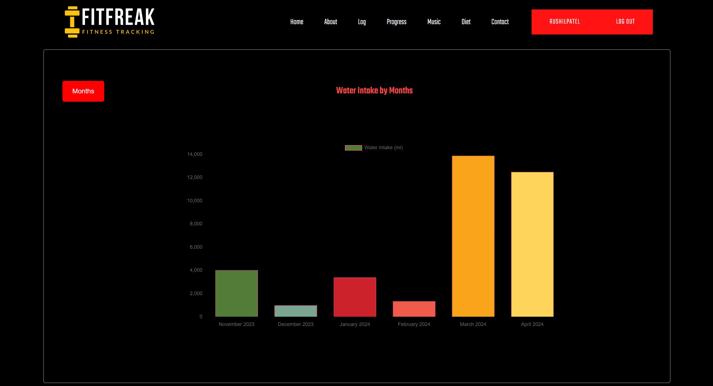
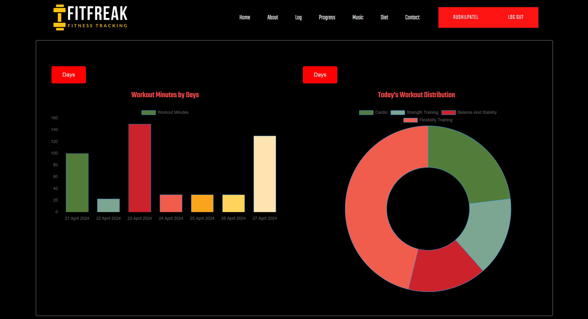
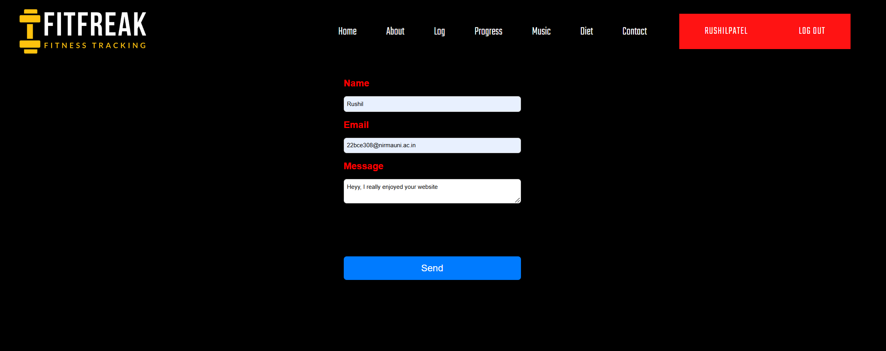
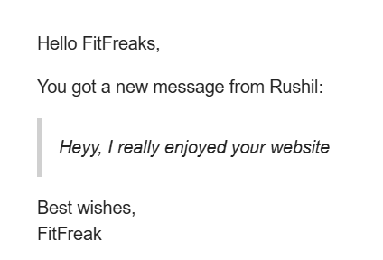

# FitFreak

Unleash your fitness potential with FitFreak! This user-friendly application caters to individuals seeking a robust workout tracking and progress monitoring tool. Whether you're a seasoned gym-goer or just starting your fitness journey, FitFreak helps you stay on top of your workouts, visualize your progress, and maintain motivation. Log various exercises, view workout history, and leverage features designed to keep you engaged on your path to achieving your fitness goals.

## Images

### Home Page

### User Details

### Workout Log

### Food Log

### Water Log

### Calories Burnt

### Water Intake

### Workout History

### Contact

### Contact's Reply Mail

## Authors

- [@rushilpatel21 ](https://github.com/rushilpatel21)
  - **Frontend Contributions**:
    1. Log - (Workout, Food, and Water Log)
    2. Progress - (Calories Burnt, Water Intake, and Workout History)
    3. Music - (Search Music and Recommended Playlist)
    4. Sign in and Sign up
    5. User details and Log out
  - **Backend Contributions**:
    1. Complete Backend using Express.Js
- [@salonidesai16](https://github.com/salonidesai16)
    - **Frontend Contributions**:
        1. Home
        2. About
        3. Contact
